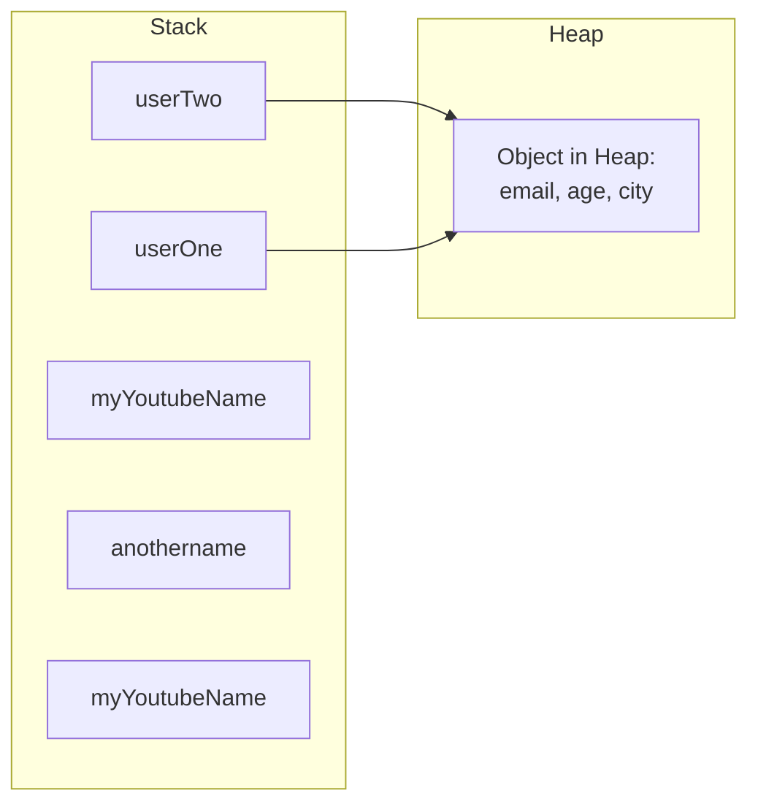

```mermaid
flowchart LR
  subgraph Stack
    userTwo[ userTwo ]
    userOne[ userOne ]
    myYoutubeName1[ myYoutubeName ]
    anotherName[ anothername ]
    myYoutubeName2[ myYoutubeName ]
  end


  subgraph Heap
    object1[Object in Heap:\nemail, age, city]
  end

  userTwo --> object1
  userOne --> object1
```
